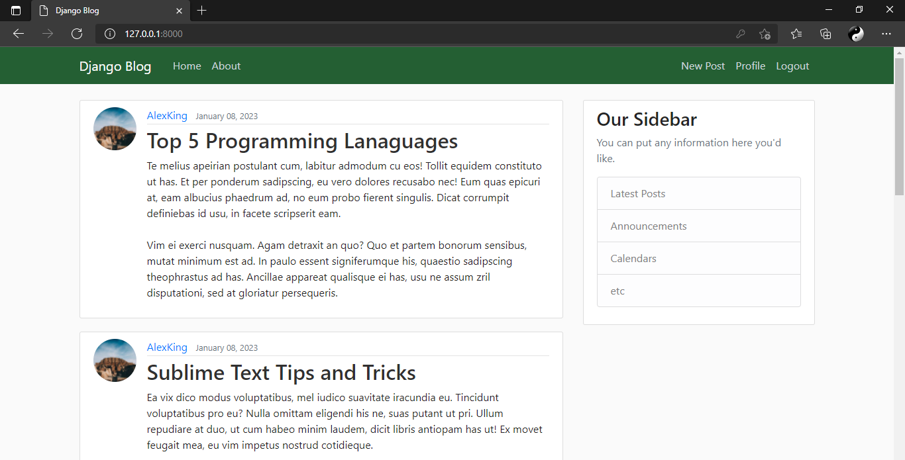

# django_project

## Aim
Using [Python](https://www.python.org/), [Django](https://www.djangoproject.com/), and [PostgreSQL](https://www.postgresql.org) to build a simple blogging website.

## Built With
- [Python](https://www.python.org/)
- [Django](https://www.djangoproject.com/)
- [Jinja](https://jinja.palletsprojects.com/en/3.1.x/)
- HTML
- CSS
- [PostgreSQL](https://www.postgresql.org)
- [Bootstrap](https://getbootstrap.com/)

## Sample Page


## Installation
Install with pip:
```
pip install -r requirements.txt
```

## Environment Configuration

### .env configuration
Create a .env file with these configurations:
```
SECRET_KEY=<your secret key>
EMAIL_HOST_USER=<your email address>
EMAIL_HOST_PASSWORD=<your email password>
DB_NAME=<database name>
DB_USER=<database username>
DB_PASSWORD=<database password>
DB_HOST=<databse hostname>
DB_PORT=<database port>
```

## Run Django
In the terminal run:
```
 python manage.py runserver
```
In Django, the default port is 8000  

Entry point: http://127.0.0.1:8000
